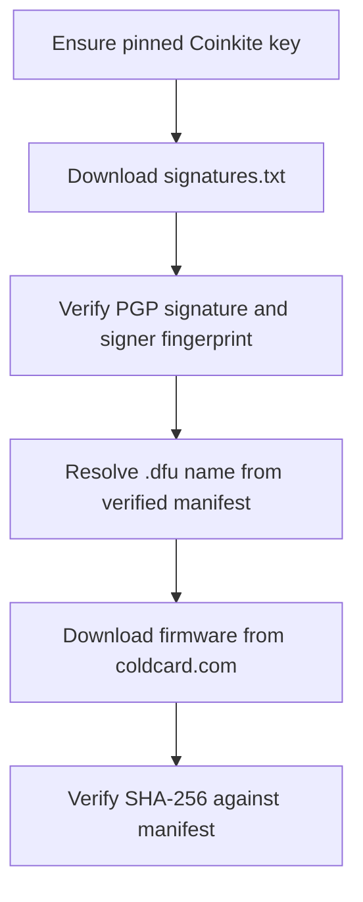

# Verification flow

ColdCard firmware verification follows Coinkite’s model: authenticate a signed manifest, then check the firmware hash against that manifest. This project automates that path; it does not replace it with a custom scheme.

## Official (manual) method

Coinkite’s documented approach is educational as well as practical:

1. Obtain `signatures.txt` from the official firmware repository.
2. Verify its PGP signature with Coinkite’s public key (`gpg --verify`).
3. Download the firmware `.dfu` from official ColdCard downloads.
4. Compare the file’s SHA-256 to the hash listed in the authenticated manifest (visually or with a hash tool).

That process is the source of truth. See https://coldcard.com/docs/ and https://coldcard.com/downloads/.

## Automated method (this script)

`cc_firmware.sh` performs the same checks in a fixed order:

Important details:

- The manifest is verified **before** the firmware download.
- The `.dfu` filename is taken from the verified manifest (not invented from a git tag alone), so both historical `mk4-coldcard` and current `mk-coldcard` names work, as do Q1 and factory builds via `--model` / `--factory`.
- `--dry-run` stops after resolving the file and prints the planned URL and expected hash without downloading the `.dfu`.

## Same guarantees, less copy-paste error

Automation does not add cryptographic strength beyond the manual method. It reduces mistakes when selecting the file and comparing hashes, while staying on official sources and the pinned Coinkite key.
