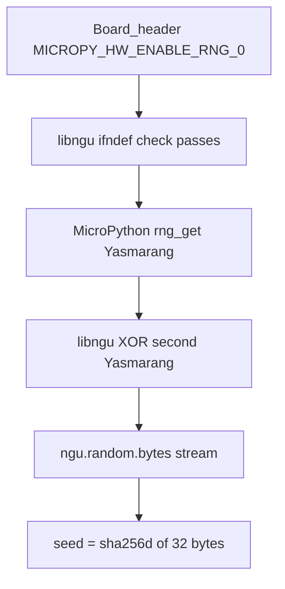

# COLDCARD RNG / Seed Entropy Incident — Technical Analysis

| Field | Value |
| --- | --- |
| Investigation id | `coldcard-rng-seed-entropy-2026` |
| Document | Technical analysis (File 2 of 2) |
| Companion | [00-SITUATION-AND-IMPACT.md](00-SITUATION-AND-IMPACT.md) |
| Independent technical source | Block Bitcoin Engineering and Security (2026-07-30), with anonymous researchers |
| Vendor technical source | Coinkite — [Technical Deep Dive into the Entropy Issue](https://blog.coinkite.com/entropy-technical-backgrounder/) (2026-07-30) |
| Vendor user advisory | Coinkite — [Mk3 Security Advisory](https://blog.coinkite.com/coldcard-mk3-seed-generation-warning/) (2026-07-30) |
| Empirical exploit validation by this repo | None — synthesis of public reports only |

This document reconstructs the failure mode for in-repo visibility. It is **not** an exploit guide. No proof-of-concept, brute-force tooling, or attack recipes are included.

---

## 1. Executive technical summary

COLDCARD production board configs define `MICROPY_HW_ENABLE_RNG` as `0` because the product supplies its own STM32 RNG wrapper (`ckcc.rng_bytes` / `random_buffer()`).

**libngu** selects its TRNG hook with `#ifndef MICROPY_HW_ENABLE_RNG`, which only checks that the macro **exists**, not that it is **non-zero**. The build therefore succeeds and libngu binds to MicroPython’s `rng_get()`.

With the macro at zero, MicroPython compiles the **Yasmarang software fallback**, initialized from MCU UID and timer registers. libngu then XORs that stream with a second Yasmarang instance seeded from **public constants**. XOR of two reproducible streams remains reproducible.

| Generation era | Critical property |
| --- | --- |
| Pre-regression (Mk2/Mk3 through v3.2.2) | Wallet entropy from `rng_bytes` → board-local STM32 HW RNG |
| Mk2/Mk3 v4.0.0–v4.1.9 | `ngu.random` path; **no** secure-element reseed |
| Mk4 / Q / Mk5 production | Same fallback binding; boot calls `reseed()` with only **four** digest bytes → ≤ \(2^{32}\) securely distinguished streams for fixed fallback state and call history |

Wallet code may hash the 32-byte RNG output (`sha256d`). Hashing cannot enlarge the set of possible seeds.

Coinkite’s technical deep dive confirms the same integration failure and estimates effective search space at about **40 bits** (Mk3) and about **72 bits** (Mk4 / Q / Mk5) under current attack assumptions. The Mk3 figure is preliminary and may change.

---

## 2. Root-cause chain



### 2.1 Production disables MicroPython’s HW RNG implementation

Board headers (locations per Block):

| File | Notes |
| --- | --- |
| `stm32/COLDCARD/mpconfigboard.h` | Mk2/Mk3-class board config |
| `stm32/COLDCARD_MK4/mpconfigboard.h` | Mk4 |
| `stm32/COLDCARD_Q1/mpconfigboard.h` | Q |

Pattern:

```c
// We have our own version of this code.
#define MICROPY_HW_ENABLE_RNG (0)
```

COLDCARD’s separate implementation reads the STM32 RNG peripheral and fails on timeout or repeated samples. Python exposes it as `ckcc.rng_bytes`.

**Attribution:** Block.

### 2.2 Libngu checks the macro incorrectly

Libngu selects its STM32 entropy function approximately as:

```c
extern uint32_t rng_get(void);
#define CHIP_TRNG_32() rng_get()

#ifndef MICROPY_HW_ENABLE_RNG
#error "get a HW TRNG plz"
#endif
```

| Check used | What it means | What was needed |
| --- | --- | --- |
| `#ifndef MACRO` | Fails only if macro is **undefined** | Reject disabled / zero-valued HW RNG |
| Macro defined as `(0)` | `#ifndef` **passes** | Should have failed closed or used `#if !MICROPY_HW_ENABLE_RNG` |

The board-local API exports `random32()` / `random_buffer()`, not a global `rng_get()`. libngu’s `rng_get` reference therefore resolves to MicroPython’s implementation.

**Attribution:** Block.

### 2.3 MicroPython compiles the software fallback

MicroPython selects implementations by macro **value**:

```c
#if MICROPY_HW_ENABLE_RNG
    // STM32 hardware RNG
#else
    // Yasmarang fallback
#endif
```

With value `0`, `rng_get()` initializes Yasmarang using:

| State word | Initialization (per Block) |
| --- | --- |
| `pad` | `UID_low32 ^ SysTick->VAL` |
| `n` | `RTC->TR` |
| `d` | `RTC->SSR` |
| `dat` | `0` |

These inputs may vary across boots but are **not** a cryptographic entropy source. After first initialization, no new entropy is collected; subsequent outputs are deterministic state transitions.

**Attribution:** Block.

### 2.4 Libngu XORs fallback with a second Yasmarang

libngu maintains a second Yasmarang state initialized with public constants (per Block):

| Variable | Initial value |
| --- | --- |
| `yasmarang_pad` | `0x0a8ce26f` |
| `yasmarang_n` | `69` |
| `yasmarang_d` | `233` |
| `yasmarang_dat` | `0` |

Each output word:

```text
chip = rng_get();       // MicroPython fallback
chip ^= my_yasmarang(); // libngu Yasmarang
```

| Operation | Security effect |
| --- | --- |
| XOR of two streams | Creates no new entropy |
| Both streams reproducible | Output reproducible |
| Health check rejecting adjacent repeated `rng_get()` values | Deterministic PRNG normally passes |

**Attribution:** Block; confirmed by Coinkite technical deep dive.

### 2.5 Vendor confirmation of migration motive

Coinkite states that in 2021 COLDCARD moved elliptic-curve operations to Bitcoin Core’s `libsecp256k1`, which required adding libNgU (embedded MicroPython bindings for `libsecp256k1` and related primitives). The cryptographic library choice was sound; the **integration** was not. During that migration, wallet seed generation moved from `ckcc.rng_bytes()` to `ngu.random.bytes()`, which resolved `rng_get()` to MicroPython’s software fallback.

Coinkite further notes that carefully crafted TRNG code remained present and was used for less important paths, while the bulk of randomness for seed generation came from a PRNG that originated in the MicroPython submodule.

**Attribution:** Coinkite technical deep dive.

### 2.6 Why existing review did not catch it

| Factor | Detail (Coinkite) |
| --- | --- |
| Same function signature | Both RNG implementations exported compatible `rng_get()`-style interfaces |
| Binary presence ≠ call path | Review confirmed intended TRNG code was in the firmware binary but did not verify end-to-end symbol resolution / reachability from wallet seed generation across submodules |
| Wrong preprocessor guard | libngu used `#ifndef MICROPY_HW_ENABLE_RNG` (see [random.c:22-31](https://github.com/switck/libngu/blob/cf1988aa54969a7d2dcef261ee664a41a7013262/ngu/random.c#L22-L31)); macro defined as zero still satisfied `#ifndef` |

**Attribution:** Coinkite technical deep dive.

### 2.7 Upstream fallback age vs COLDCARD exposure

| Fact | Detail |
| --- | --- |
| MicroPython Yasmarang fallback introduced upstream | May 2018 ([micropython commit f68e722005](https://github.com/micropython/micropython/commit/f68e722005)) |
| Entered COLDCARD wallet seed generation | libNgU migration, March 2021 ([Coldcard/firmware `b18723dd…`](https://github.com/Coldcard/firmware/commit/b18723dddb6d751c39978e4364b56b2414f68b47)) |
| “Eight-year” figure | Describes age of the **upstream** fallback code, **not** the duration of affected COLDCARD seed generation (Coinkite) |

Relevant MicroPython file: [micropython/ports/stm32/rng.c](https://github.com/micropython/micropython/blob/master/ports/stm32/rng.c#L36).

**Attribution:** Coinkite technical deep dive.

### 2.8 Hotfix mechanics (5.6.0 / 1.5.0Q)

Coinkite’s emergency hotfix for current products:

| Release | Models |
| --- | --- |
| **5.6.0** | Mk4 and Mk5 |
| **1.5.0Q** | Q1 |

| Hotfix property | Detail (Coinkite) |
| --- | --- |
| Features | No new features; generates entropy correctly |
| Build exclusion | Explicitly excludes MicroPython’s fallback PRNG object |
| Build-time check | Build fails unless the board-specific object defines the global `rng_get()` symbol and the upstream fallback object defines no symbols |

Install via official [COLDCARD upgrade docs](https://coldcard.com/docs/upgrade/). Updating firmware does not repair seeds already generated on affected firmware.

**Attribution:** Coinkite technical deep dive.

---

## 3. Regression: wallet generation moved to `ngu.random`

### 3.1 Before (safe path for this issue)

Firmware v3.2.2 style (per Block):

```python
seed = bytearray(32)
rng_bytes(seed)
```

This reached `ckcc.rng_bytes` and the board-local STM32 hardware RNG.

### 3.2 After (vulnerable path)

Commit [`b18723dddb6d751c39978e4364b56b2414f68b47`](https://github.com/Coldcard/firmware/commit/b18723dddb6d751c39978e4364b56b2414f68b47) (2021-03-01) changed generation to:

```python
seed = random.bytes(32)
```

`shared/random.py` mapped this to `ngu.random.bytes`. First released in firmware **v4.0.0** (2021-03-17).

Mk2/Mk3 v4 do **not** execute the later Mk4 reseeding code.

**Attribution:** Block; Coinkite technical deep dive confirms the same migration. Coinkite’s user advisory centers on Mk3 from **4.0.1** onward.

---

## 4. Mk4 / Q / Mk5: 32-bit reseed

### 4.1 Boot reseeding (introduced for Mk4)

Commit `01cb43f7` (per Block) added secure-element reseeding approximately as:

```python
a = callgate.read_rng(1)        # 32 bytes from SE1
b = callgate.read_rng(2)        # 8 bytes from SE2

n = ngu.hash.sha256d(a + b)
n, = ustruct.unpack('I', n[0:4])
ngu.random.reseed(n)
```

| Input | Block’s characterization |
| --- | --- |
| SE1 32 bytes | Authenticated value incorporating SE unpredictability |
| SE2 8 bytes | Authenticated bytes from a ROM-options page (not a live random command) |
| Bytes reaching `reseed()` | **Only 4** digest bytes (`uint32`) |

### 4.2 What `reseed()` actually does

Complete reseed implementation (per Block):

```c
STATIC mp_obj_t random_reseed(mp_obj_t arg)
{
    yasmarang_pad = mp_obj_get_int_truncated(arg);
    return mp_const_none;
}
```

| Property | Present? |
| --- | --- |
| Accept full digest | No |
| Initialize a cryptographic DRBG | No |
| Reseed MicroPython’s fallback Yasmarang | No |
| Reset other Yasmarang state words | No |
| Periodic reseeding / prediction resistance | No |

For fixed fallback state \(F\) and call history \(T\):

\[
\bigl|\{\,\mathrm{output}(R, F, T) : R \in [0, 2^{32})\,\}\bigr| \le 2^{32}
\]

Internal state evolution may spread those 32 bits across later output; it cannot create additional entropy.

**Attribution:** Block.

---

## 5. Wallet hashing does not repair entropy

Current-style wallet generation (per Block):

```python
seed = ngu.random.bytes(32)
assert len(set(seed)) > 4
return ngu.hash.sha256d(seed)
```

| Step | Entropy effect |
| --- | --- |
| Distinct-byte assertion (`> 4`) | Detects only trivial failures; Yasmarang passes easily |
| `sha256d` | May improve statistical appearance; **does not** enlarge input family |
| BIP39 checksum | Adds no entropy |

```text
≤ 2^32 candidate RNG outputs
        ↓ SHA256d
≤ 2^32 candidate wallet seeds
```

**Attribution:** Block.

---

## 6. UID and timer characteristics

MicroPython initializes fallback Yasmarang **once**, on the first `rng_get()` call.

| Input | Characteristics | Security consequence |
| --- | --- | --- |
| MCU UID | Fixed 96-bit per-chip id; only **low 32 bits** used | Device identity, not fresh entropy; partly reflected in USB serial |
| SysTick | Predictable periodic down-counter | At most ~80,000 (Mk2/Mk3) or ~120,000 (current devices) values |
| `RTC->TR` | Time-of-day register | Correlated with boot time; potentially static |
| `RTC->SSR` | RTC subsecond counter | Correlated with `RTC->TR` and execution timing |

### 6.1 MCU UID notes

- Factory manufacturing identifier; **not** a cryptographic secret (Block).
- Readable from memory; partly transformed into COLDCARD USB serial.
- Different devices may share the same low 32-bit word.
- If `UID_low32` is known, it adds no search space.
- If completely unknown, `UID_low32 XOR SysTick` still has at most \(2^{32}\) possible results (values collapse into one 32-bit `pad`).

### 6.2 SysTick bounds

| Platform | Approx. SysTick possibilities | log₂ (approx.) |
| --- | --- | --- |
| Mk2 / Mk3 | 80,000 | \(2^{16.29}\) |
| Mk4 / Q / Mk5 | 120,000 | \(2^{16.87}\) |

These are maximum enumeration counts, not guaranteed entropy. Knowledge of when the first RNG call occurs can reduce the range.

### 6.3 RTC notes

- `RTC->TR` and `RTC->SSR` are correlated with each other and SysTick; treating them as independent overstates strength.
- For legacy Mk2/Mk3 startup, Block reports the selected RTC oscillator is disabled, strongly suggesting zero or static RTC values on a normal cold boot.
- Current devices configure an RTC source but label it unused; MicroPython RTC init remains disabled. Exact runtime behavior needs hardware measurement.

### 6.4 Security interpretation

Timer/UID values may create operational uncertainty for an attacker, but they are:

- Fixed or timing-derived rather than randomly sampled
- Potentially observable or reconstructable
- Correlated rather than independent
- Collected only once
- Fed into a non-cryptographic PRNG

**Attribution:** Block.

---

## 7. Search-space assessment

### 7.1 Mk2 / Mk3 v4

| Attacker knowledge | Candidate picture (Block) |
| --- | --- |
| Fixed UID, timer state, and RNG-call history | \(2^{0}\) — deterministic |
| Known UID, unknown SysTick, normal cold boot | Ceiling ≈ \(2^{16.29}\) (80,000 SysTick values) |
| Effective 32-bit `UID_low32 XOR SysTick` entirely unknown | Ceiling \(2^{32}\) |
| Unknown call history | Multiplies counts by number of plausible execution traces |

Broad upper bound counting every SysTick and RTC state with known UID/history: about \(2^{40.7}\). If RTC is stable on cold boot: roughly \(2^{16.3}\) from SysTick alone.

### 7.2 Mk4 / Q / Mk5

| Condition | Candidate picture (Block) |
| --- | --- |
| Successful reseed; known fallback state and call history | ≤ \(2^{32}\) secure reseed possibilities; ~\(2^{31}\) average enumeration |
| Deliberately loose known-UID ceiling treating timer fields independent | ≈ \(2^{41.27}\) fallback states; with reseed ≈ \(2^{73.27}\) raw ceiling |

Block emphasizes the ~73-bit figure is **not** 73-bit cryptographic security: timer fields are correlated, may occupy smaller ranges, and may be observable.

### 7.3 Summary table

| Device / firmware | Attacker knows timers | Best-case hidden-timer ceiling |
| --- | --- | --- |
| Mk1; Mk2/Mk3 through v3.2.2 | ≈ \(2^{256}\) | ≈ \(2^{256}\) |
| Mk2/Mk3 v4.0.0–v4.1.9 | \(2^{0}\) | \(< 2^{40.7}\) |
| Mk4/Q/Mk5, successful reseed | ≤ \(2^{32}\) | \(< 2^{73.3}\) |
| Mk4/Q/Mk5, no reseed† | \(2^{0}\) | \(< 2^{41.3}\) |

† Conditional source path; ordinary production SE failure appears to halt rather than continue (Block).

Block’s ≈ \(2^{256}\) for pre-regression devices is the raw 32-byte seed space; Coinkite’s “expected **128**” elsewhere is the intended security target, not a contradiction of that raw space.

**Attribution:** Block.

### 7.4 Coinkite vendor estimates (current attack assumptions)

| Device class | Coinkite estimate | Notes |
| --- | --- | --- |
| Mk3 (affected) | ≈ **40 bits** effective search space | Preliminary; may change as analysis continues |
| Mk4 / Q / Mk5 (affected) | ≈ **72 bits** effective search space | SE1/SE2 entropy mixed in as backup-to-backup; did not restore intended 128-bit target |

**Attribution:** Coinkite technical deep dive. Compare with Block’s ceilings in §7.1–7.3 and the mapping in §11.

---

## 8. Conditional reseed failure

Early boot wraps `mk4.init0()` / `q1.init0()` in a broad exception handler that can continue after catchable errors. A catchable exception **before** reseeding could leave libngu at its public initial state.

However, current production SE1/SE2 communication and authentication failures normally enter non-returning bootloader failure paths. It is **not established** that ordinary production hardware failure silently proceeds without reseeding.

| Structure | Assessment |
| --- | --- |
| Broad fail-open exception around init | Dangerous pattern; called out by Block |
| Proven 32-bit successful-reseed weakness | Separate, established from source review |
| Silent no-reseed in ordinary production failures | Not established |

**Attribution:** Block.

---

## 9. Other affected functionality

The same `ngu.random` / `my_random_bytes()` construction feeds multiple features. Severity varies; all inherit the entropy limits of the stream.

| Feature | How RNG is used (Block) | Validation oracle / impact sketch |
| --- | --- | --- |
| New and ephemeral wallet seeds | 32 bytes → often `sha256d` → BIP39 | Address / xpub |
| Paper-wallet secp256k1 keys | RNG output used **directly** as private key | Bitcoin address; “Use Dice” bypasses RNG |
| Random seed XOR masks | Mask from `ngu.random.bytes`, then hashed | If share `B` exposed, enumerate masks against address/xpub; default deterministic split unaffected |
| Cloning ECDH keys | Ephemeral keys; pubkeys on MicroSD / filename | Candidate privkey vs pubkey; session decrypt risk for clone backup |
| USB encryption device keypair | Random device keypair | Captured transcript public keys; session confidentiality |
| Key Teleport | Temp ECDH keys + 5-byte secondary password | Captured exchange may allow testing candidates; decrypt teleported secret |
| Key Teleport multisig-PSBT variant | RNG mainly selects child index | Index prediction ≠ wallet key if seed secure; weak original seed still separate issue |
| Web2FA | 10-byte TOTP secret, ephemeral ECDH, nonces | Protocol-specific; weak TOTP / request exposure |
| Secure Notes passwords | `generate_seed()` / `ngu.random.uniform()` | Dual `generate_seed()` calls do not double entropy |
| HSM local-code material | Consumes same stream | Inherits entropy limits |

**Safe relative path for comparison:** callers of `ckcc.rng_bytes` use the separate STM32 HW RNG implementation.

**Attribution:** Block.

**Synthesis (this investigation):** For user-facing guidance on these same features, see [00-SITUATION-AND-IMPACT.md](00-SITUATION-AND-IMPACT.md) §10 ("Other features that may inherit weak RNG").

### 9.1 Paper wallets (extra detail)

```text
Generate Paper Wallet
  → ngu.secp256k1.keypair()
  → my_random_bytes(32)
  → private key
  → public address and WIF
```

Referenced paths (Block): `shared/paper.py` (~line 91), `external/libngu/ngu/k1.c` (~line 428). Compromising a paper-wallet key affects that address’s funds, not necessarily the main BIP39 wallet.

### 9.2 Random XOR split (extra detail)

Two-part random split sketch:

```text
A = random mask
B = original_seed XOR A
```

| Attacker obtains | Consequence sketch (Block) |
| --- | --- |
| `B` only | Enumerate candidate masks → candidate seeds; validate vs address/xpub |
| `A` only | Share alone does not reveal original seed |
| Default deterministic split | Does not use `ngu.random`; separate from this bug |

---

## 10. Multisig implications

| Arrangement | Implication |
| --- | --- |
| Quorum composed exclusively of keys from vulnerable generation | Vulnerability impact remains |
| Quorum requiring at least one safely generated key | Can limit theft from a single weak cosigner, depending on policy |
| “We use multisig” as a slogan without key provenance review | Insufficient |

**Attribution:** Block. Operational migration still belongs in [00-SITUATION-AND-IMPACT.md](00-SITUATION-AND-IMPACT.md).

---

## 11. Mapping Coinkite estimates to Block’s ceilings

| Statement | Source | How to read it |
| --- | --- | --- |
| Mk3 affected ≈ **40 bits** effective search space under current attack assumptions | Coinkite technical deep dive | Vendor estimate; preliminary / may change |
| Mk4 / Q / Mk5 affected ≈ **72 bits** rather than expected **128** | Coinkite (advisory + deep dive) | Vendor estimate after SE1/SE2 mixing; still below target |
| Successful reseed ⇒ ≤ \(2^{32}\) securely distinguished streams for fixed fallback state/history | Block | Hard ceiling on **secure-element-derived** distinction after state is fixed |
| Loose known-UID raw ceiling including timers ≈ \(2^{73.27}\) | Block | Upper bound under independence assumptions Block rejects as cryptographic security; near Coinkite’s ~72-bit framing |
| Mk2/Mk3 v4 broad hidden-timer ceiling \(< 2^{40.7}\); can be deterministic given UID/timers/history | Block | Aligns with Coinkite’s ~40-bit Mk3 estimate and “funds may be at risk” warning |

**Synthesis (this investigation):** Coinkite’s technical deep dive and Block’s report describe the same defect class. Coinkite now publishes vendor root-cause confirmation plus ~40/~72-bit estimates; Block remains the most detailed independent search-space and feature-blast-radius analysis. Exact field exploit cost depends on UID knowledge, boot timing, prior RNG calls, and derivation cost — Block claims no end-to-end brute-force benchmark.

---

## 12. Technical timeline

| Date | Event | Source |
| --- | --- | --- |
| 2018-05 | MicroPython STM32 Yasmarang fallback introduced upstream | Coinkite |
| 2021-01-28 | Vulnerable libngu STM32 guard pattern exists | Block |
| 2021-03-01 | COLDCARD migrates wallet generation to libngu ([`b18723dd…`](https://github.com/Coldcard/firmware/commit/b18723dddb6d751c39978e4364b56b2414f68b47)) | Block / Coinkite |
| 2021-03-17 | Firmware **v4.0.0** includes vulnerable path | Block |
| 2022-03-11 | 32-bit reseed API and Mk4 boot reseeding added (`01cb43f7`) | Block |
| 2022-03-14 | First production Mk4 **v5.0.0** includes reseed | Block |
| 2026-07-30 | Fund-loss reports noticed; investigation begins | Block |
| 2026-07-30 | Independent root-cause findings; broader impact research | Block |
| 2026-07-30 | Coinkite Mk3 advisory published | Coinkite / Block |
| 2026-07-30 | Block discloses to Coinkite (noting differences) and publishes report | Block |
| 2026-07-30 | Coinkite technical deep dive published; hotfixes **5.6.0** / **1.5.0Q** | Coinkite |

---

## 13. Impact model (non-operational)

Block’s impact framing, preserved carefully:

1. An attacker who can determine or sufficiently constrain device UID, timer state, and RNG-call history can reproduce the fallback stream offline.
2. A wallet xpub, address, or generated public key provides a candidate-validation oracle.
3. Successful recovery of seed or private key permits theft of associated funds.
4. This does **not** mean every remote attacker can immediately recover every seed.
5. Practical cost depends on available UID information, boot timing, prior RNG calls, and derivation cost.
6. No end-to-end brute-force benchmark is claimed in the Block report.
7. Block states active exploitation is under way; this repository has not independently verified that claim.

For user triage and migration: [00-SITUATION-AND-IMPACT.md](00-SITUATION-AND-IMPACT.md).

---

## 14. Code / path index (as cited by Block and Coinkite)

| Path / symbol | Relevance |
| --- | --- |
| `stm32/COLDCARD/mpconfigboard.h` | `MICROPY_HW_ENABLE_RNG (0)` |
| `stm32/COLDCARD_MK4/mpconfigboard.h` | Same |
| `stm32/COLDCARD_Q1/mpconfigboard.h` | Same |
| [libngu `ngu/random.c`](https://github.com/switck/libngu/blob/cf1988aa54969a7d2dcef261ee664a41a7013262/ngu/random.c#L22-L31) `#ifndef MICROPY_HW_ENABLE_RNG` | Incorrect enable check |
| [MicroPython `ports/stm32/rng.c`](https://github.com/micropython/micropython/blob/master/ports/stm32/rng.c#L36) | HW RNG vs Yasmarang software fallback |
| `ckcc.rng_bytes` / board `random_buffer()` | Intended HW RNG path |
| `shared/random.py` → `ngu.random` | Python mapping after regression |
| Commit [`b18723dd…`](https://github.com/Coldcard/firmware/commit/b18723dddb6d751c39978e4364b56b2414f68b47) | Wallet generation switch (libNgU migration) |
| Commit `01cb43f7` | Mk4 SE reseed |
| `random_reseed` setting `yasmarang_pad` only | 32-bit reseed limitation |
| `shared/paper.py` | Paper wallet key generation |
| `external/libngu/ngu/k1.c` | secp256k1 keypair RNG consumption |
| Coinkite dice hashing in `shared/seed.py` (advisory link) | Dice rolls mixed with device entropy on Add Dice Rolls path |

Upstream tree: https://github.com/Coldcard/firmware

---

## 15. References

| Reference | URL |
| --- | --- |
| Coinkite — Technical Deep Dive into the Entropy Issue | https://blog.coinkite.com/entropy-technical-backgrounder/ |
| Coinkite — Mk3 Security Advisory | https://blog.coinkite.com/coldcard-mk3-seed-generation-warning/ |
| Block — Predictable RNG Fallback and 32-Bit Reseed in COLDCARD Firmware | https://engineering.block.xyz/blog/predictable-rng-fallback-and-32-bit-reseed-in-coldcard-firmware |
| LLFOURN — Attack-cost model for affected COLDCARD generations (cited by Coinkite) | https://x.com/LLFOURN/status/2082990000896147942 |
| COLDCARD firmware upgrade docs | https://coldcard.com/docs/upgrade/ |
| COLDCARD firmware repository | https://github.com/Coldcard/firmware |
| COLDCARD downloads | https://coldcard.com/downloads/ |
| COLDCARD dice-roll math docs | https://coldcard.com/docs/verifying-dice-roll-math/ |
| MicroPython STM32 `rng.c` | https://github.com/micropython/micropython/blob/master/ports/stm32/rng.c#L36 |
| libngu `random.c` preprocessor guard | https://github.com/switck/libngu/blob/cf1988aa54969a7d2dcef261ee664a41a7013262/ngu/random.c#L22-L31 |

---

## 16. Document control

| Version | Date | Notes |
| --- | --- | --- |
| 1.0 | 2026-07-31 | Initial technical synthesis in this repository |
| 1.1 | 2026-07-31 | Incorporate Coinkite technical deep dive; hotfix/review-miss notes; upgrade docs + related refs |

**Standards used in this file**

- Material claims tagged by source (Block / Coinkite / Synthesis).
- Distinguishes source-review conclusions from pending hardware validation.
- Omits exploit procedures and tooling.
