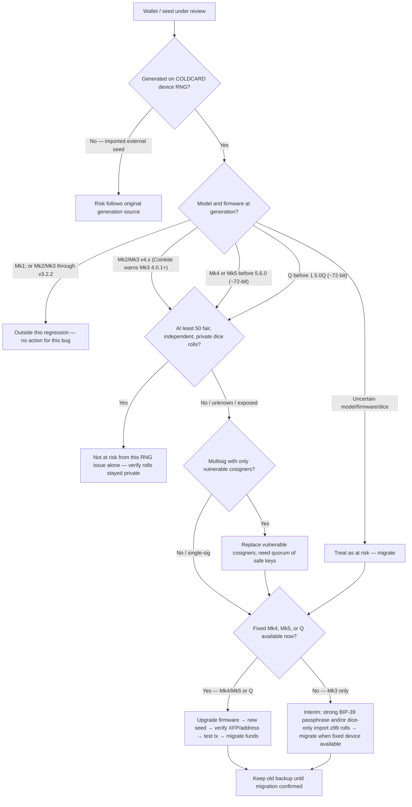

# COLDCARD RNG / Seed Entropy Incident (2026)

| Field | Value |
| --- | --- |
| Investigation id | `coldcard-rng-seed-entropy-2026` |
| Public disclosure | 2026-07-30 |
| Package role | Documentation only — this repository does not generate seeds or talk to devices |
| Affiliation | Not affiliated with Coinkite Inc. |

Third-party incident notes for the July 2026 COLDCARD firmware RNG / seed-entropy issue. Kept **outside** product `docs/` so this CLI’s verification threat model is not mixed with a device advisory.

---

## Documents in this folder

| File | Role |
| --- | --- |
| [00-SITUATION-AND-IMPACT.md](00-SITUATION-AND-IMPACT.md) | Who/what is affected, risk triage, migration steps |
| [01-TECHNICAL-ANALYSIS.md](01-TECHNICAL-ANALYSIS.md) | Root cause, search spaces, feature blast radius |

Detailed migration prose and tables: File 00, §5–§7.

---

## Migration decision tree

Use the **model and firmware at seed generation**, not today’s version. Guidance below synthesizes Coinkite and Block public advisories; it is not new policy from this repository.

### Mermaid



**Fixed firmware targets for new seed generation**

| Device | Minimum fixed version |
| --- | --- |
| Mk4 | 5.6.0+ |
| Mk5 | 5.6.0+ |
| Q | 1.5.0Q+ |
| Mk3 | No fixed release confirmed; do not wait if migration applies |

Upgrade procedure: https://coldcard.com/docs/upgrade/

### ASCII outline

```text
Wallet / seed under review
│
├─ Generated on COLDCARD device RNG?
│  ├─ No (imported external seed)
│  │    └─ Risk follows original generation source
│  │
│  └─ Yes → Model and firmware at generation?
│       ├─ Mk1; or Mk2/Mk3 through v3.2.2
│       │    └─ Outside this regression → no action for this bug
│       │
│       ├─ Mk2/Mk3 v4.x  (Coinkite user warning: Mk3 4.0.1+)
│       ├─ Mk4 / Mk5 before 5.6.0   (~72-bit)
│       ├─ Q before 1.5.0Q          (~72-bit)
│       └─ Uncertain
│            │
│            └─ ≥ 50 fair, independent, private dice rolls?
│                 ├─ Yes → Not at risk from this RNG issue alone
│                 │         (still verify rolls were never exposed)
│                 │
│                 └─ No / unknown / exposed → AT RISK
│                      │
│                      ├─ Multisig of only vulnerable keys?
│                      │    └─ Replace vulnerable cosigners;
│                      │       need a quorum of safely generated keys
│                      │
│                      └─ Fixed Mk4 / Mk5 / Q available now?
│                           ├─ Yes
│                           │    1. Upgrade (Mk4/Mk5 ≥ 5.6.0, Q ≥ 1.5.0Q)
│                           │    2. Generate completely new seed
│                           │    3. Verify backup, XFP, receive address
│                           │    4. Small test transaction
│                           │    5. Migrate remaining funds
│                           │    6. Keep old backup until confirmed
│                           │
│                           └─ No (Mk3 only)
│                                ├─ Interim: strong unique BIP-39 passphrase
│                                │   (move funds carefully; verify XFP)
│                                └─ and/or dice-only import ≥ 99 rolls
│                                    on empty Mk3 4.1.9
│                                    (Import Existing > Dice Rolls;
│                                     not New Wallet)
│                                Then migrate to fixed Mk4/Mk5/Q when available
```

---

## Canonical sources

This is the **single** source list for the investigation package. Body documents keep operational inline links and technical code citations; they do not repeat this table.

| Source | URL | Role |
| --- | --- | --- |
| Coinkite — Mk3 Security Advisory | https://blog.coinkite.com/coldcard-mk3-seed-generation-warning/ | Vendor user guidance, affected versions, migration, dice/passphrase |
| Coinkite — Technical Deep Dive into the Entropy Issue | https://blog.coinkite.com/entropy-technical-backgrounder/ | Vendor root-cause confirmation, ~40/~72-bit estimates, hotfix notes |
| Block Engineering — Predictable RNG Fallback and 32-Bit Reseed | https://engineering.block.xyz/blog/predictable-rng-fallback-and-32-bit-reseed-in-coldcard-firmware | Independent technical root cause, search spaces, feature blast radius |
| LLFOURN — Attack-cost model (cited by Coinkite) | https://x.com/LLFOURN/status/2082990000896147942 | Third-party attack-cost framing |
| COLDCARD firmware upgrade docs | https://coldcard.com/docs/upgrade/ | Official install/upgrade procedure before generating a new seed |
| COLDCARD Mk4 vs Mk3 docs | https://coldcard.com/docs/coldcard-mk4/ | Hardware/model background (dual secure elements, Mk4 capabilities) |
| COLDCARD firmware downloads | https://coldcard.com/downloads/ | Firmware versions (incl. 5.6.0 / 1.5.0Q hotfixes) |
| COLDCARD BIP-39 passphrase docs | https://coldcard.com/docs/passphrase/ | Interim passphrase procedure |
| COLDCARD dice-roll method | https://coldcard.com/docs/verifying-dice-roll-math/ | Dice-only verification reference |
| COLDCARD firmware source | https://github.com/Coldcard/firmware | Upstream code paths |

---

## Document control

| Version | Date | Notes |
| --- | --- | --- |
| 1.0 | 2026-07-31 | Folder index, Mk*/Q migration decision tree, canonical sources |
