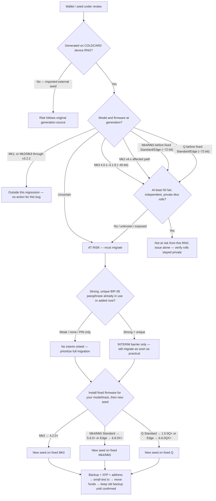

# COLDCARD RNG / Seed Entropy Incident (2026)

| Field | Value |
| --- | --- |
| Investigation id | `coldcard-rng-seed-entropy-2026` |
| Public disclosure | 2026-07-30 (Coinkite advisory updated 2026-07-31 with fixed releases for all models) |
| Package role | Documentation only — this repository does not generate seeds or talk to devices |
| Affiliation | Not affiliated with Coinkite Inc. |

Third-party incident notes for the July 2026 COLDCARD firmware RNG / seed-entropy issue. Kept **outside** product `docs/` so this CLI’s verification threat model is not mixed with a device advisory.

---

## Documents in this folder

| File | Role |
| --- | --- |
| [00-SITUATION-AND-IMPACT.md](00-SITUATION-AND-IMPACT.md) | Who/what is affected, risk triage, migration steps |
| [01-TECHNICAL-ANALYSIS.md](01-TECHNICAL-ANALYSIS.md) | Root cause, search spaces, feature blast radius |

Detailed migration prose and tables: File 00, §5–§7.

---

## Migration decision tree

Use the **model and firmware at seed generation**, not today’s version. Guidance below synthesizes Coinkite and Block public advisories; it is not new policy from this repository.

**Two different ideas — do not mix them:**

| Kind of hope | What it is | What it is not |
| --- | --- | --- |
| **Interim barrier** | A **strong, unique BIP-39 passphrase** (not the PIN) can add an independent barrier on top of an affected seed (Coinkite). Weak / common / patterned / quoted / reused passphrases may be guessable and should not be assumed to help. | Not a repair. Even with a strong passphrase, Coinkite says migrate to a **newly generated** seed **as soon as practical**. |
| **Real exit** | Install **fixed** firmware for your model/track → generate a **new** seed → verify → test tx → move funds. Firmware update does **not** repair the old seed. | Not optional forever. Dice ≥50 private at original creation is the main exception for “not at risk from this RNG issue alone.” |

### Mermaid



**Fixed firmware targets for new seed generation** (Coinkite, updated 2026-07-31)

| Device | Standard track | Edge track |
| --- | --- | --- |
| Mk3 | **4.2.0+** | — |
| Mk4 | **5.6.0+** | **6.6.0X+** |
| Mk5 | **5.6.0+** | **6.6.0X+** |
| Q | **1.5.0Q+** | **6.6.0QX+** |

Standard and Edge are **separate** release tracks. If you use Edge, install the fixed Edge build for your model. Do not assume an older Edge 6.x is fixed just because its number is higher than the Standard release (Coinkite).

Upgrade procedure: https://coldcard.com/docs/upgrade/

**Optional (advanced):** After Mk3 **4.2.0+**, dice-only import (≥99 rolls via `Import Existing > Dice Rolls`) can create a replacement seed without the device RNG. Normal `New Wallet` is corrected in 4.2.0; dice-only is not required to address this issue.

**Multisig (side note):** If every cosigner key was generated on affected firmware, replace vulnerable cosigners; you need a quorum of safely generated keys (Block).

### ASCII outline

```text
Wallet / seed under review
│
├─ Generated on COLDCARD device RNG?
│  ├─ No (imported) → risk follows original source
│  │
│  └─ Yes → model/firmware at generation?
│       ├─ Mk1; or Mk2/Mk3 through v3.2.2
│       │    └─ Outside this regression
│       │
│       ├─ Mk3 4.0.1–4.1.9              (~40-bit)
│       ├─ Mk2 v4.x (affected path)
│       ├─ Mk4/Mk5 before fixed Std/Edge (~72-bit)
│       ├─ Q before fixed Std/Edge       (~72-bit)
│       └─ Uncertain
│            │
│            └─ ≥ 50 fair, independent, private dice?
│                 ├─ Yes → Not at risk from this RNG issue alone
│                 │
│                 └─ No / unknown / exposed → AT RISK (must migrate)
│                      │
│                      ├─ Strong unique BIP-39 passphrase?
│                      │    ├─ Weak / none / PIN only
│                      │    │    └─ No interim shield → migrate now
│                      │    └─ Strong + unique
│                      │         └─ INTERIM only → still migrate
│                      │              as soon as practical (Coinkite)
│                      │
│                      └─ REAL EXIT — fixed firmware → NEW seed
│                           ├─ Mk3:     Standard 4.2.0+
│                           ├─ Mk4/Mk5: Standard 5.6.0+  or Edge 6.6.0X+
│                           └─ Q:       Standard 1.5.0Q+ or Edge 6.6.0QX+
│                                then: backup → XFP/address → test tx
│                                      → move funds → keep old backup
│                                      until confirmed
```

---

## Canonical sources

This is the **single** source list for the investigation package. Body documents keep operational inline links and technical code citations; they do not repeat this table.

| Source | URL | Role |
| --- | --- | --- |
| Coinkite — Mk3 Security Advisory | https://blog.coinkite.com/coldcard-mk3-seed-generation-warning/ | Vendor user guidance, affected versions, migration, dice/passphrase; Mk3 4.2.0 + Edge fixed releases |
| Coinkite — Technical Deep Dive into the Entropy Issue | https://blog.coinkite.com/entropy-technical-backgrounder/ | Vendor root-cause confirmation, ~40/~72-bit estimates, hotfix notes |
| Block Engineering — Predictable RNG Fallback and 32-Bit Reseed | https://engineering.block.xyz/blog/predictable-rng-fallback-and-32-bit-reseed-in-coldcard-firmware | Independent technical root cause, search spaces, feature blast radius |
| LLFOURN — Attack-cost model (cited by Coinkite) | https://x.com/LLFOURN/status/2082990000896147942 | Third-party attack-cost framing |
| COLDCARD firmware upgrade docs | https://coldcard.com/docs/upgrade/ | Official install/upgrade procedure before generating a new seed |
| COLDCARD Mk4 vs Mk3 docs | https://coldcard.com/docs/coldcard-mk4/ | Hardware/model background (dual secure elements, Mk4 capabilities) |
| COLDCARD firmware downloads | https://coldcard.com/downloads/ | Firmware versions (incl. 4.2.0 / 5.6.0 / 1.5.0Q / Edge hotfixes) |
| COLDCARD BIP-39 passphrase docs | https://coldcard.com/docs/passphrase/ | Passphrase procedure (interim barrier; not a seed repair) |
| COLDCARD dice-roll method | https://coldcard.com/docs/verifying-dice-roll-math/ | Dice-only verification reference |
| COLDCARD firmware source | https://github.com/Coldcard/firmware | Upstream code paths |

---

## Document control

| Version | Date | Notes |
| --- | --- | --- |
| 1.0 | 2026-07-31 | Folder index, Mk*/Q migration decision tree, canonical sources |
| 1.1 | 2026-07-31 | Rewrite tree: passphrase = interim for any at-risk seed; real exit = fixed firmware + new seed; Mk3 4.2.0 + Edge |
